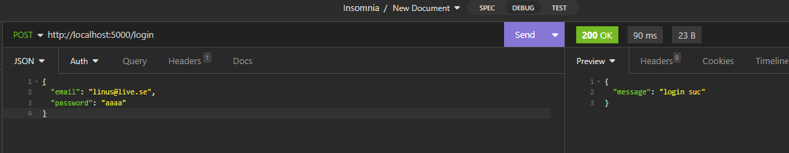
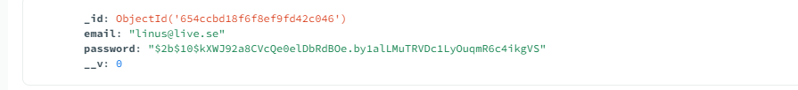

Jag är glad att dela med mig av mitt senaste projekt - U09-uppgiften som innebär skapandet av en e-handelsplattform för mitt egna klädmärke, Savastano Milano. Genom att tillämpa de kunskaper jag har fått genom kursen har jag utvecklat en komplett e-handelswebbplats som integrerar både frontend och backend-funktionalitet.

E-handelsplattformen erbjuder en smidig och användarvänlig upplevelse för våra kunder. Genom att implementera säkra autentiseringsmetoder och krypterad databehandling, prioriterar vi säkerheten för användarnas personuppgifter. Dessutom har jag integrerat betalningsgateway för att säkerställa en sömlös och trygg köpupplevelse.

För att visualisera och planera projektet använde jag mig av Figma för att skapa detaljerade skisser. User personas hjälpte mig att skapa en design och funktionalitet som möter användarnas specifika behov och förväntningar. Genom att följa användarcentrerade metoder strävar jag efter att erbjuda en webbplats som inte bara är funktionell utan också engagerande och tilltalande för vår målgrupp.

För att ge dig en inblick i min process, bifogar jag länkar till Figma-skisserna och user personas. 

figma och user personas. 
https://www.figma.com/file/hu5JmOTCosxVKMbIvWUE1R/Savastano-milano-u09?type=design&node-id=0-1&mode=design&t=UXgewICyduPzLZdG-0

Länk till min undersökning:
https://docs.google.com/forms/d/e/1FAIpQLSdM2jbo3XRbd-5e9eq2Zr1S75gTPAC8QC71bm2BjUw8-tK4eA/viewform?usp=sf_link

insomnia:

;
;

MONGDODB:

;

